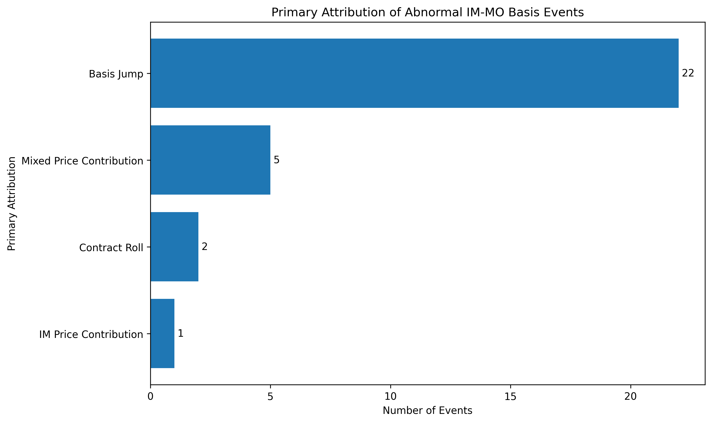

# IM-MO Synthetic Futures Statistical Arbitrage Backtest

## Overview

This project implements a statistical arbitrage backtest between CSI 1000 Index Futures (IM) and CSI 1000 Index Options (MO) synthetic futures.

The synthetic futures price is constructed using the put-call parity relationship:

Synthetic Future = Call − Put + Strike

The strategy investigates whether the spread between the listed index futures and synthetic futures exhibits mean reversion, and evaluates the profitability after incorporating realistic transaction costs.

The project is inspired by the statistical arbitrage framework discussed in the CITIC Futures research report, while the complete backtesting framework, contract selection logic and implementation are independently developed.
# Results

The framework generates:

- Net value curve
- Basis movement analysis
- Abnormal event detection
- Automated attribution report
## Backtest Summary

The backtest is performed using one IM futures contract combined with two MO call options and two MO put options.

### Trading Configuration

| Parameter | Value |
|---|---:|
| Number of Trades | 47 |
| Position Size | 1 Group |
| Strategy Structure | Long/Short IM + 2 Call + 2 Put |
| Market Impact | 0.08% |

### Transaction Cost Assumption

| Cost Item | Value |
|---|---:|
| MO Trading Fee | 15 RMB / contract |
| MO Exercise Fee | 2 RMB / contract |
| IM Trading Fee | 0.23 bp |
| IM Delivery Fee | 1 bp |
| Market Impact | 0.08% |

### Performance Summary

| Metric | Result |
|---|---|
|initial captial|10,000,000 RMB|
| Gross Profit | 767,200 RMB |
| Total Transaction Cost | 203,559 RMB |
| Net Profit | 563,641 RMB |
| Return Before Cost | 7.672% |
| Return After Cost | 5.636% |
| Final Gross NAV | 1.0767 |
| Final Net NAV | 1.0564 |
| Win Rate | 100% |
## Visualization

### Net Value Curve


### Basis Attribution Analysis




### Synthetic Futures Backtest


## Backtest Performance


## Strategy

### 1. Contract Selection

For each trading day:

- Select the active IM futures contract
- Filter MO options satisfying

```
ATM_distance = |Strike − Spot| / Spot < 5%
```

- Choose the strike with the highest trading volume
- Construct synthetic futures

```
Synthetic = Call − Put + Strike
```

---

### 2. Spread Construction

```
Basis = IM Futures − Synthetic Futures
```

A positive basis indicates that futures are relatively expensive.

A negative basis indicates that synthetic futures are relatively expensive.

---

### 3. Signal Generation

Rolling statistics are computed using historical information only.

```
Window = 100 days

Rolling Mean

Rolling Standard Deviation
```

Trading bands:

```
Upper = Mean + Std

Lower = Mean − Std
```

Entry rules:

- Basis > Upper
    → Short Basis

- Basis < Lower
    → Long Basis

---

### 4. Exit Rules

The position is closed when

- Basis reverts to the rolling mean

or

- Contract expiration

or

- Contract rollover

---

## Transaction Cost Model

The backtest considers

- IM futures trading fee
- IM delivery fee
- MO option trading fee
- MO exercise fee
- Market impact
- Position scaling

Both gross profit and net profit are reported.

---

## Backtesting Framework

```
Market Data

↓

Contract Selection

↓

Synthetic Futures Construction

↓

Basis Calculation

↓

Rolling Statistics

↓

Trading Signal

↓

Position Management

↓

PnL Calculation

↓

Transaction Cost

↓

Performance Evaluation
```

---

## Performance Metrics

The backtest reports

- Total Gross Profit
- Total Net Profit
- Annualized Return
- Win Rate
- Sharpe Ratio
- Profit Factor
- Maximum Drawdown
- Average Holding Period

---


## Project Structure

```text
IM-MO-Synthetic-Futures-Arbitrage
│
├── data/
│   ├── event_calendar.csv
│   └── final_data_for_backtest.csv
│
├── outputs/
│   ├── figures/
│   │   ├── IM_MO_Basis_Attribution_Summary.png
│   │   ├── MO synthetic future - IM arbitrage backtest.png
│   │   └── MO-IM Arbitrage Net Value Curve.png
│   │
│   ├── IM_MO_Research_Report.md
│   ├── IM_MO_研究报告.md
│   ├── abnormal_basis_events.csv
│   ├── attribution_results.csv
│   ├── attribution_with_events.csv
│   └── final_data.csv
│
├── src/
│   ├── attribution.py
│   ├── event_analysis.py
│   ├── event_calendar.py
│   ├── report_generator.py
│   └── visualization.py
│
├── MO-IM synthetic future arbitrage backtest.ipynb
│
├── README.md
│
└── .gitignore

---

## Future Improvements

- Lock option contracts after opening positions
- Introduce bid-ask spread using tick data
- Dynamic market impact estimation
- Walk-forward parameter validation
- Portfolio-level capital allocation
- Multi-contract statistical arbitrage

---

## Disclaimer

This project is intended solely for educational and research purposes.

It does not constitute investment advice.
